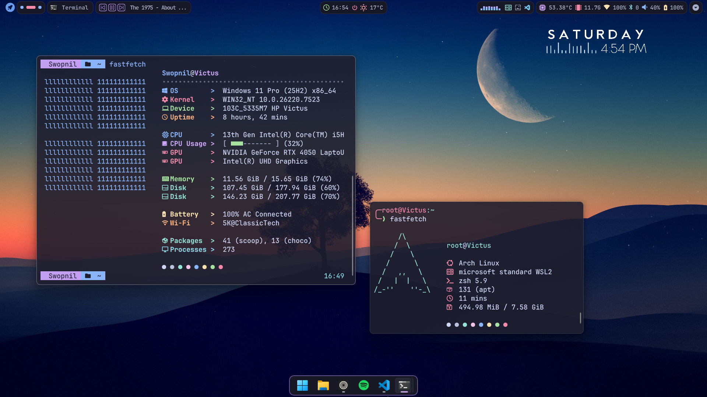
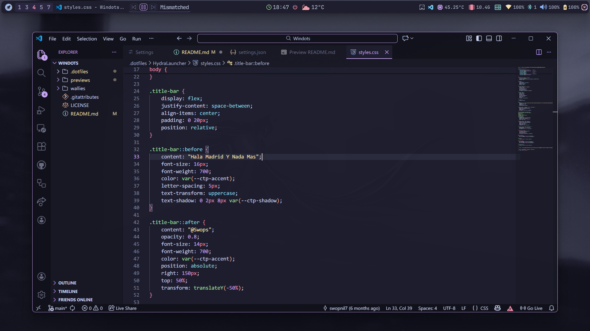
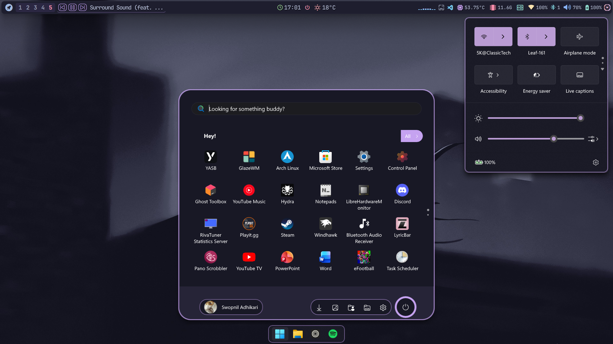
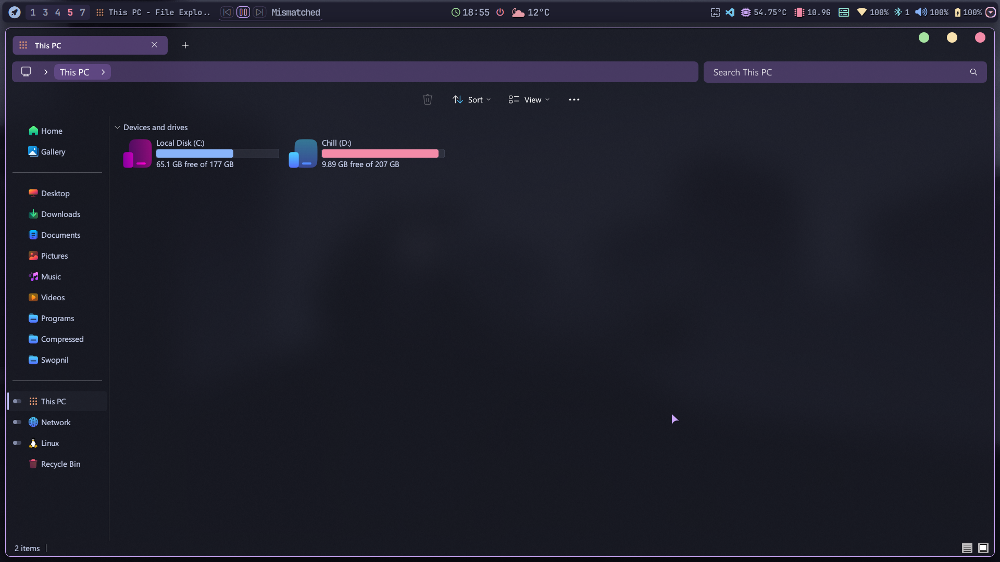
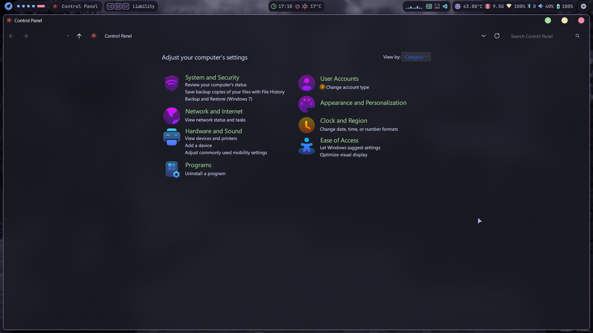
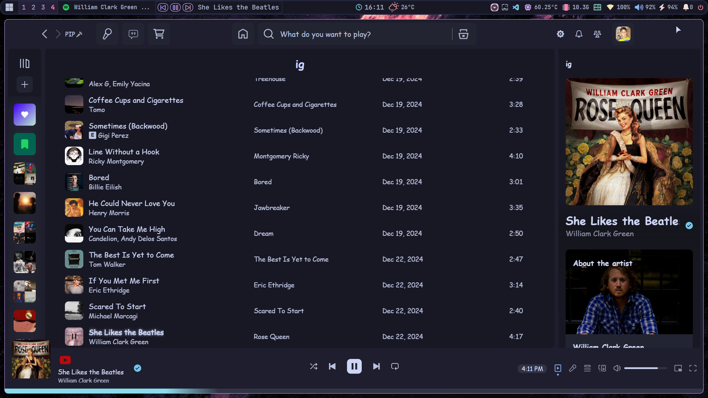
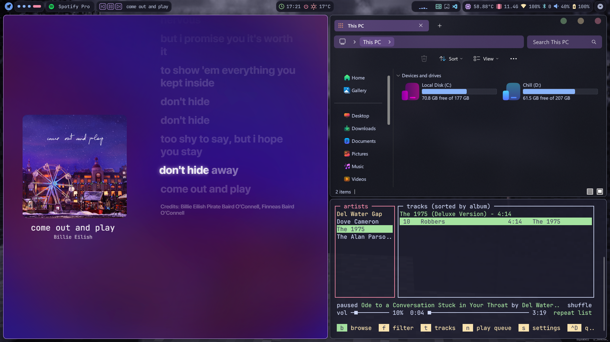
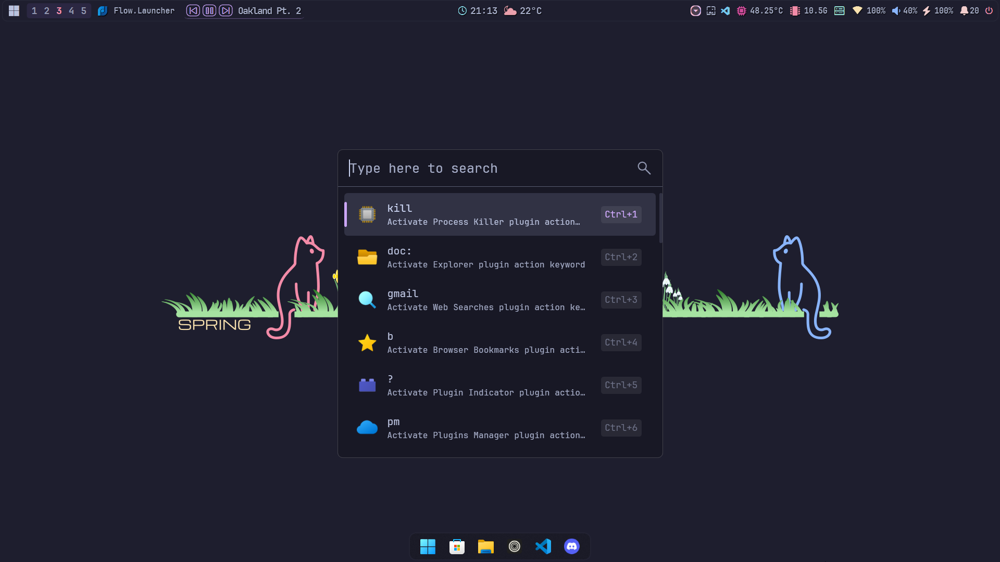
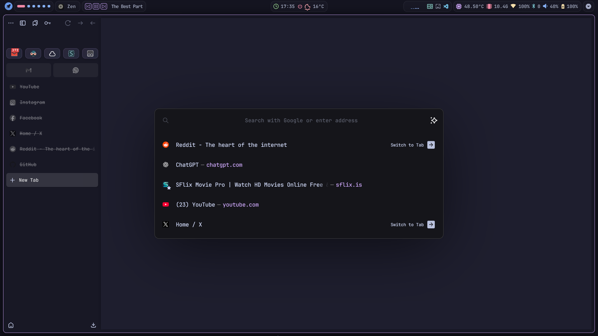
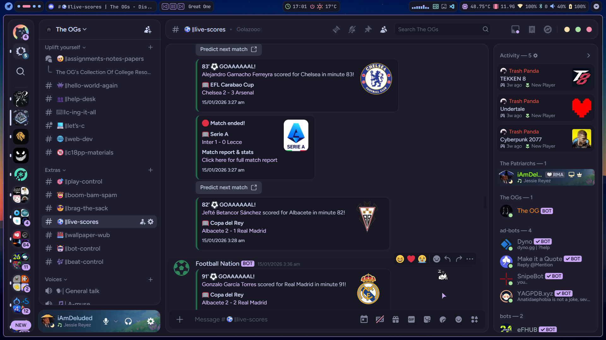

<!-- Windots README - Enhanced Aesthetics -->

<p align="center">
  
</p>

<h1 align="center">
  <span align="center">

  

  </span>
</h1>

<p align="center">
  
</p>

<div align="center">
  <a href="https://github.com/swopnil7/windots/stargazers">
    
  </a>
  <a href="https://github.com/swopnil7/windots/">
    
  </a>
  <a href="https://github.com/swopnil7/windots/commits/main/">
    
  </a>
  <a href="https://github.com/swopnil7/windots/blob/main/LICENSE">
    
  </a>
</div>

<br>

<br/><br/>
<br/><br/>
<br/><br/>
<br/><br/>
<br/><br/>
<br/><br/>
<br>

<hr>

## 💕 About

> _A Catppuccin Mocha themed Windows dotfiles setup for those who love a beautiful, unified, and productive desktop._

If you love customizing every detail or just want a gorgeous, cohesive look with minimal hassle, **Windots** is for you. Whether you're a power user or just want things to look and work great out of the box, you'll find something here to make your Windows experience smoother and more enjoyable.

---

## 🌠 Features

<div align="center">

|  |  |
|:--:|:--:|
| 🪟 **GlazeWM** tiling window manager | 🍫 **YASB** status bar |
| 🧑‍💻 **VSCode** clean setup | \>_ **Windows Terminal** modern look |
| 🐚 **PowerShell** enhancements | 🎨 **Oh My Posh** prompt |
| ⚙️ **fastfetch** system info | 🚀 **Flow Launcher** workflow |
| 🦅 Themed Start menu, Taskbar, Notification Center | 🧱 [Wallpapers](https://github.com/swopnil7/windots/tree/main/wallies#readme) |
| 🐈‍⬛ [Catppuccin Mocha](https://github.com/catppuccin) color scheme everywhere | 🌺 Theme for Almost Everything |

</div>

---

## 🌺 Core System Overview

| Component | Tool |
|---|---|
| **OS** | [Windows 11](https://www.microsoft.com/en-in/windows/windows-11) 🖥️ |
| **Window Manager** | [GlazeWM](https://github.com/glzr-io/glazewm) 🪟 |
| **Shells** | [PowerShell](https://learn.microsoft.com/en-us/powershell/) 💻 |
| **Terminal** | [Windows Terminal](https://github.com/microsoft/terminal) 🖲️ |
| **Status Bar** | [YASB](https://github.com/amnweb/yasb) 📊 |
| **Editors** | [VSCode](https://code.visualstudio.com/) 📝 |
| **Launcher** | [Flow Launcher](https://www.flowlauncher.com/) 🔍 |
| **File Managers** | [File Explorer](https://www.microsoft.com/en-us/windows/tips/file-explorer) 🗂️ |
| **Web Browser** | [Zen-Browser](https://zen-browser.app) 🌎 |
| **Theme** | [Catppuccin](https://catppuccin.com/) 🧁 |

---

<details>
<summary><strong>ℹ️ Complete System Overview</strong></summary>

#### 🪟 System

| 📚 Entry | ✨ App |
|---|---|
| **OS** | [Windows 11](https://www.microsoft.com/en-in/windows/windows-11) |
| **Window Manager** | 🤍 [GlazeWM](https://github.com/glzr-io/glazewm) [⚙️](https://github.com/swopnil7/windots/blob/master/.dotfiles/glazewm/config.yaml) |
| **Bar** | 🤍 [YASB](https://github.com/amnweb/yasb) [⚙️](https://github.com/swopnil7/windots/blob/master/.dotfiles/yasb/) |
| **Application Launcher** | 🤍 [Flow Launcher](https://www.flowlauncher.com/) [⚙️](https://github.com/swopnil7/windots/blob/main/.dotfiles/FlowLauncher/Settings.json) |
| **Mods** | 🤍 [Windhawk](https://windhawk.net/) [⚙️](https://github.com/swopnil7/windots/blob/main/.dotfiles/windhawk/) |
| **Context Menu** | [Nilesoft Shell](https://nilesoft.org/) [⚙️](https://github.com/swopnil7/windots/blob/main/.dotfiles/nilesoftshell/) |
| **Theme** | 🤍 [SecureUxTheme](https://github.com/namazso/SecureUxTheme) with [Nivuu's Catppuccin Mocha theme](https://www.deviantart.com/niivu/art/Catppuccin-for-Windows-11-1076249390) |

#### 🖥️ CLI/TUI Apps

| 📚 Entry | ✨ App |
|---|---|
| **Shell** | [pwsh](https://learn.microsoft.com/en-us/powershell/module/microsoft.powershell.core/about/about_pwsh?view=powershell-7.4) [⚙️](https://github.com/swopnil7/windots/blob/main/.dotfiles/Powershell/Microsoft.PowerShell_profile.ps1) |
| **Terminal Emulator** | [windows terminal](https://github.com/microsoft/terminal) [⚙️](https://github.com/swopnil7/windots/blob/main/.dotfiles/terminal/settings.json) |
| **Shell Prompt** | [ohmyposh](https://ohmyposh.dev/) [⚙️](https://github.com/swopnil7/windots/blob/main/.dotfiles/ohmyposh/zen.toml) |
| **System Fetch** | 🤍 [fastfetch](https://github.com/fastfetch-cli/fastfetch) [⚙️](https://github.com/swopnil7/dotfiles/blob/master/.dotfiles/fastfetch/config.jsonc) |

#### 🖱️ GUI Apps

| 📚 Entry | ✨ App |
|---|---|
| **Fallback Text Editor** | [VSCode](https://code.visualstudio.com/) [⚙️](https://github.com/swopnil7/windots/blob/main/.dotfiles/vscode/settings.json) |
| **Music Player** | 🤍 [Spotify](https://open.spotify.com/) (patched with [Spicetify](https://spicetify.app/)) |
| **Web Browser** | 🤍 [Zen-Browser](https://zen-browser.app) [⚙️](https://github.com/swopnil7/windots/blob/main/.dotfiles/zen/) |
| **Note Taking App** | 🤍 [Obsidian](https://obsidian.md/) |
| **File Manager** | [File Explorer](https://www.microsoft.com/en-us/windows/tips/file-explorer) |
| **Game Launcher** | [Hydra Launcher](https://hydralauncher.gg/) [⚙️](https://github.com/swopnil7/windots/blob/main/.dotfiles/HydraLauncher/) |
| **Clipboard Manager** | [CopyQ](https://github.com/hluk/CopyQ) [⚙️](https://github.com/swopnil7/windots/blob/main/.dotfiles/copyq/) |
| **Torrent Manager** | [qBittorrent](https://www.qbittorrent.org/) [⚙️](https://github.com/swopnil7/windots/blob/main/.dotfiles/qBittorrent/) |
| **Discord Client** | 🤍 [Vencord](https://vencord.dev/) [⚙️](https://github.com/swopnil7/windots/blob/main/.dotfiles/vencord/) |
| **YouTube Music Client** | [Th-Ch YouTube Music](https://github.com/th-ch/youtube-music) [⚙️](https://github.com/swopnil7/windots/blob/main/.dotfiles/youtubemusic/) |
| **Web Themer** | 🤍 [Stylus](https://addons.mozilla.org/en-US/firefox/addon/stylus/) (for Firefox) with 🤍 [Catppuccin Mocha](https://github.com/catppuccin) [⚙️](https://github.com/catppuccin/userstyles/blob/main/docs/USAGE.md) |

#### 🔍 Other

| 📚 Entry | ✨ App |
|---|---|
| **Colorscheme** | 🤍 [Catppuccin Mocha](https://catppuccin.com) |
| **Font** | [JetBrainsMono Nerd Font](https://www.jetbrains.com/lp/mono/) |

</details>

---

<details>
<summary><strong>## 🔧 Setup</strong></summary>

> **⚠️ Backup your current configuration files before continuing.**  
> Applying these settings may overwrite existing configs, so be sure to manually merge or restore as needed.

### 🪟 GlazeWM

- **Install** [**GlazeWM**](https://github.com/glzr-io/glazewm/releases/).
- [`windots/.dotfiles/glazewm/config.yaml`](.dotfiles/glazewm/config.yaml) → `%USERPROFILE%\.glzr\glazewm\config.yaml`
- **Restart GlazeWM** for the changes to take effect.

### 📊 YASB (Yet Another Status Bar)

> [!NOTE]
> Ensure you have a Nerd Font installed for correct icon display. I use **JetBrainsMono Nerd Font**; if you use another Nerd Font, adjust the font settings in the YASB `styles.css` as needed.

- **Install** [**YASB**](https://github.com/amnweb/yasb/releases/).
- [`windots/.dotfiles/yasb/`](.dotfiles/yasb/) → `%USERPROFILE%\.dotfiles\yasb\`
- **Restart YASB** for the changes to take effect.

### 📝 VSCode

> [!WARNING]
> Use VSCode `v1.91.1`, as newer versions do not support the **APC Customize UI extension**.

- Enhance your **VSCode UI** with these **extensions**:
  - [APC Customize UI](https://marketplace.visualstudio.com/items?itemName=drcika.apc-extension) - Customize the VSCode interface
  - [GlassIt-VSC](https://marketplace.visualstudio.com/items?itemName=s-nlf-fh.glassit) - Add a transparent/glass effect (optional)
- [`windots/.dotfiles/vscode/settings.json`](.dotfiles/vscode/settings.json) → `%APPDATA%\Code\User\settings.json`
- **Restart VSCode** to load the updated settings.

### 🌐 Browser

> [!NOTE]
> These configs are applicable **only for Firefox-based browsers**.

- Enable **userChrome.css and userContent.css**:
  - Open `about:config` in the address bar.
  - Search for `toolkit.legacyUserProfileCustomizations.stylesheets`.
  - Set it to `true`.
- **Locate your profile folder**:
  - Open `about:support` in the address bar.
  - Find "Profile Folder" and click "Open Folder."
- **Copy the browser styling configs**:
  - [`windots/.dotfiles/zen/userChrome.css`](.dotfiles/zen/userChrome.css) → `<Your Profile Folder>/chrome/userChrome.css`
  - [`windots/.dotfiles/zen/userContent.css`](.dotfiles/zen/userContent.css) → `<Your Profile Folder>/chrome/userContent.css`
- **Restart your browser** for the changes to take effect.

### 🚀 Flow Launcher

- **Install** [**Flow Launcher**](https://www.flowlauncher.com/)
- [`windots/.dotfiles/FlowLauncher/settings.json`](.dotfiles/FlowLauncher/settings.json) → `%APPDATA%\FlowLauncher\Settings\Settings.json`
- **Restart Flow Launcher**

### 🦅 Windhawk

- **Install** [**Windhawk**](https://windhawk.net/).
- **Install Relevant Mods** from the [Windhawk Store](https://windhawk.net/explore):
  - Notification Center Styler
  - Start Menu Styler
  - Taskbar Styler
  - Windows 11 File Explorer Styler
- **Copy** the Windhawk config files from [`windots/.dotfiles/windhawk/`](.dotfiles/windhawk/)
- Open the relevant mod’s **details page**, go to **Advanced > Mod Settings**, paste the config, and click **"Load"** to apply it.

### 🐚 Nilesoft Shell

- **Install** [**Nilesoft Shell**](https://nilesoft.org/).
- **Copy** the shell config files from [`windots/.dotfiles/nilesoftshell/`](.dotfiles/nilesoftshell/) → `C:\Program Files\Nilesoft Shell`
- **Open** the app with admin permissions and click on **Register**

### 🚀 Hydra Launcher

- **Copy the content inside [`windots/.dotfiles/HydraLauncher/settings.json`](.dotfiles/HydraLauncher/settings.json)
- **Open** Hydra Launcher and go to **Settings** > **Appearance** > **Create**, type any name and press enter, then paste the config and save the file to apply it.

### 🌐 qBittorrent

- **Download** the config from [`windots/.dotfiles/qBittorrent/`](.dotfiles\qBittorrent\catppuccin-mocha.qbtheme) & place it anywhere safe into a folder of your choice. I suggest making a separate folder for themes like `C:\scripts\themes\`
- **Open** qBittorrent and on the top bar go to **Tools** > **Options**, check the Use custom UI Theme options & then browse and select the downloaded theme file.

### 🎥 YouTube Music

- **Install** [**Th-Ch YouTube Music**](https://github.com/th-ch/youtube-music/releases).
- **Download** the config from [`windots/.dotfiles/youtubemusic/`](.dotfiles/youtubemusic/yt-music.css) & place it anywhere safe into a folder of your choice, probably the same folder you used for the qBittorrent theme.
- **Open** YouTube Music and on the top bar go to **Options** > **Visual Tweaks** > **Theme** and click on Import custom css file, then browse and select the downloaded theme file.

### ©️ CopyQ

- **Install** [**CopyQ**](https://github.com/hluk/CopyQ/releases).
- **Copy** the config files from [`windots/.dotfiles/copyq/`](.dotfiles/copyq/catppuccin mocha.ini) → `%APPDATA%\Roaming\CopyQ\themes`
- **Open** CopyQ, on the top bar go to **File** > **Preferences** > **Appearance**, click on load theme, select the `catppuccin mocha.ini` file you copied earlier, and click on **Apply**.

### \>_ Terminal & Shell Setup

#### 🖥️ Windows Terminal

- **Install** [**Windows Terminal**](https://github.com/microsoft/terminal)
- [`windots/.dotfiles/terminal/settings.json`](.dotfiles/terminal/settings.json) → `%LOCALAPPDATA%\Packages\Microsoft.WindowsTerminal_8wekyb3d8bbwe\LocalState\settings.json`
- **Restart Windows Terminal** to see the updated config.

#### 🐚 PowerShell

- [`windots/.dotfiles/Powershell/Microsoft.PowerShell_profile.ps1`](.dotfiles/Powershell/Microsoft.PowerShell_profile.ps1) → `%USERPROFILE%\Documents\WindowsPowerShell(Powershell)\Microsoft.PowerShell_profile.ps1`
- Restart PowerShell to apply the changes.

#### 🎨 Oh My Posh

- **Install** [**Oh My Posh**](https://ohmyposh.dev/docs/installation/windows) using winget:

  ```bash
  winget install JanDeDobbeleer.OhMyPosh -s winget
  ```

- [`windots/.dotfiles/ohmyposh/zen.toml`](.dotfiles/ohmyposh/zen.toml) → `%USERPROFILE%\.dotfiles\ohmyposh\zen.toml`

#### ⚙️ Fastfetch

- **Install** [**fastfetch**](https://github.com/fastfetch-cli/fastfetch) using **winget**:

  ```bash
  winget install fastfetch
  ```

- [`windots/.dotfiles/fastfetch/config.jsonc`](.dotfiles/fastfetch/config.jsonc) → `%USERPROFILE%\.dotfiles\fastfetch\config.jsonc`
- [`windots/.dotfiles/fastfetch/windows.txt`](.dotfiles/fastfetch/windows.txt) → `%USERPROFILE%\.dotfiles\fastfetch\windows.txt`
- **Run fastfetch**.

</details>

---

## ⌨️ GlazeWM Keybindings

<details>
<summary>Show Keybindings</summary>

| Keys | Action |
|---|---|
| <kbd>alt</kbd> + <kbd>enter</kbd> | Open terminal |
| <kbd>alt</kbd> + <kbd>shift</kbd> + <kbd>enter</kbd> | Open terminal as administrator |
| <kbd>alt</kbd> + <kbd>h</kbd> / <kbd>j</kbd> / <kbd>k</kbd> / <kbd>l</kbd> | Focus window left / top / bottom / right |
| <kbd>alt</kbd> + <kbd>shift</kbd> + <kbd>⬅️</kbd> / <kbd>⬆️</kbd> / <kbd>⬇️</kbd> / <kbd>➡️</kbd> | Move focusing window left / top / bottom / right |
| <kbd>alt</kbd> + <kbd>q</kbd> | Close focusing window |
| <kbd>alt</kbd> + <kbd>1-9</kbd> | Focus workspace {n} |
| <kbd>alt</kbd> + <kbd>shift</kbd> + <kbd>1-9</kbd> | Move focusing window to workspace {n} |
| <kbd>alt</kbd> + <kbd>m</kbd> | Toggle window minimization |
| <kbd>alt</kbd> + <kbd>f</kbd> | Toggle window maximization |
| <kbd>alt</kbd> + <kbd>v</kbd> | Change tiling direction |
| <kbd>alt</kbd> + <kbd>t</kbd> | Make focusing window float/tiled |
| <kbd>alt</kbd> + <kbd>shift</kbd> + <kbd>e</kbd> | Exit glazewm |

</details>

---

## 🖼️ Gallery

> You can check out the **wallpapers** [**here**](https://github.com/swopnil7/windots/tree/main/wallies/) if you're interested!

<div align="center">

| **GUI Text Editor** | **Start Menu, Taskbar and Notification Center** |
|:--:|:--:|
|  |  |

| **Music Player and CLI Music Visualiser** | **Power Menu** |
|:--:|:--:|
|  |  |

| **Tiling Window Manager** | **Flow Launcher** |
|:--:|:--:|
|  |  |

| **Spotify Client** | **Web Browser** |
|:--:|:--:|
|  |  |

| **Discord Client** |  |
|:--:|:--:|
|  |  |

</div>

---

## 📢 Discussions

Have questions, suggestions, or want to showcase your setup? Or maybe you need some help?  
Visit the [Discussions](https://github.com/swopnil7/windots/discussions) section.

> **⚠️ Please open an [issue](https://github.com/swopnil7/windots/issues) _only_ for reproducible bugs or critical problems.**  
> For all other questions, feedback, or general help, [Discussions](https://github.com/swopnil7/windots/discussions) is **preferred**.

---

## 🎉 Credits

Special mention to the following resources and projects that were especially helpful during setup:

- [**Matt-FTW**](https://github.com/Matt-FTW/dotfiles) for inspiring the overall design of this **README** 🙏
- [**pivoshenko**](https://github.com/pivoshenko/catppuccin-startpage) for the clean and aesthetic **browser startpage** 🌐
- [**GlazeWM**](https://github.com/glzr-io/glazewm) for delivering an outstanding **tiling window manager** that boosts productivity ✨
- [**YASB**](https://github.com/amnweb/yasb) for a **customizable and feature-rich status bar** that fits seamlessly into the setup 🚀
- [**Catppuccin**](https://catppuccin.com) for creating the **best color scheme** ever 🖌️

---

```
## 💫 Star History

<p align="center">  </p>
