<!-- Windots -->

<p align="center">
  
</p>

<h1 align="center">
  <span align="center">

  

  </span>
</h1>

<p align="center">
  
</p>

<div align="center">
<p>
<a href="https://github.com/swopnil7/windots/stargazers"></a>&nbsp;&nbsp;
<a href="https://github.com/swopnil7/windots/"></a>&nbsp;&nbsp;
<a href="https://github.com/swopnil7/windots/commits/main/"></a>&nbsp;&nbsp;
<a href="https://github.com/swopnil7/windots/blob/main/LICENSE"></a>&nbsp;&nbsp;
</p>
</div>

<br>

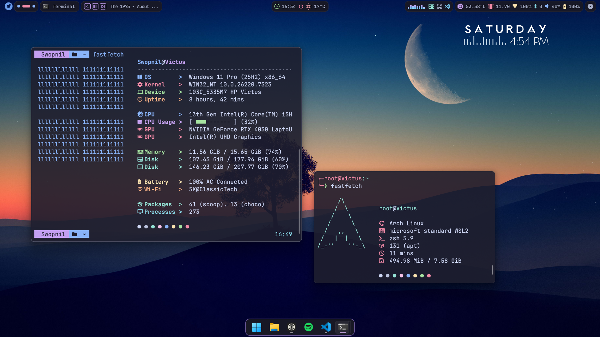<br/><br/>
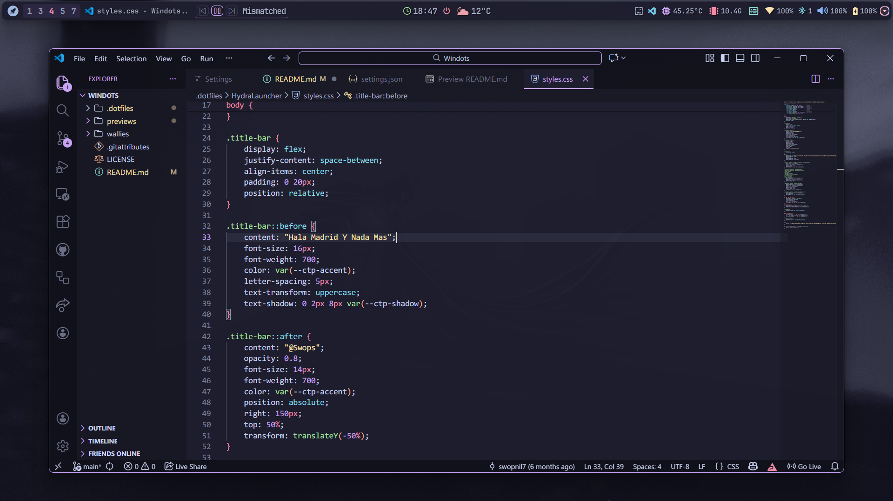<br/><br/>
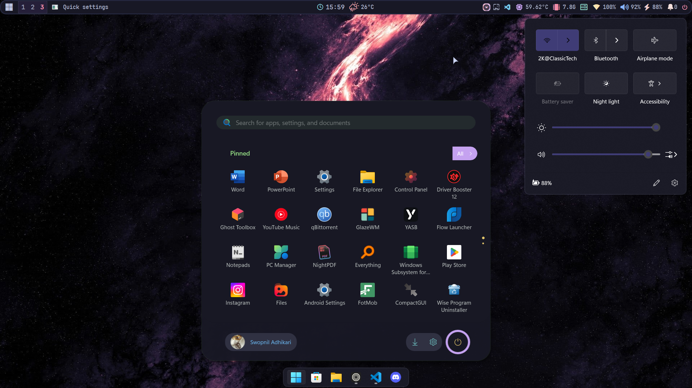<br/><br/>
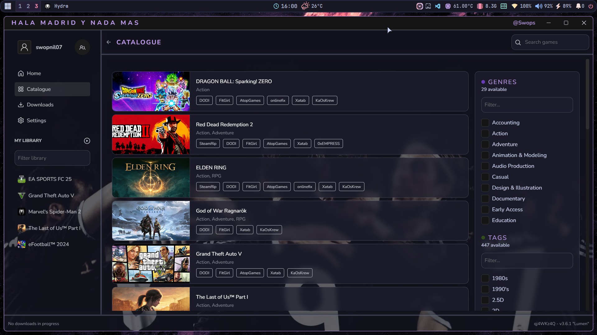<br/><br/>
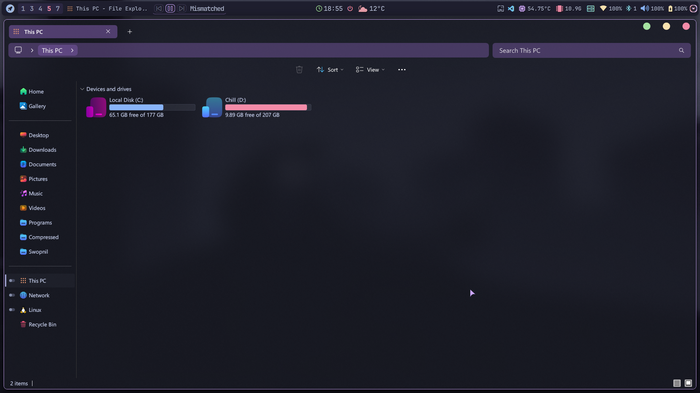<br/><br/>
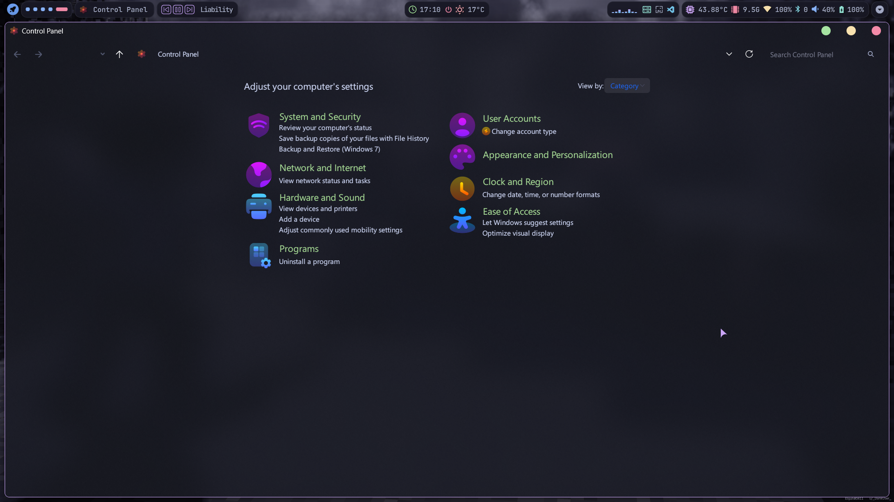<br/><br/>
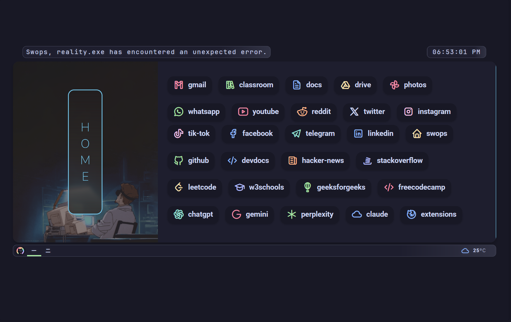<br><br/>
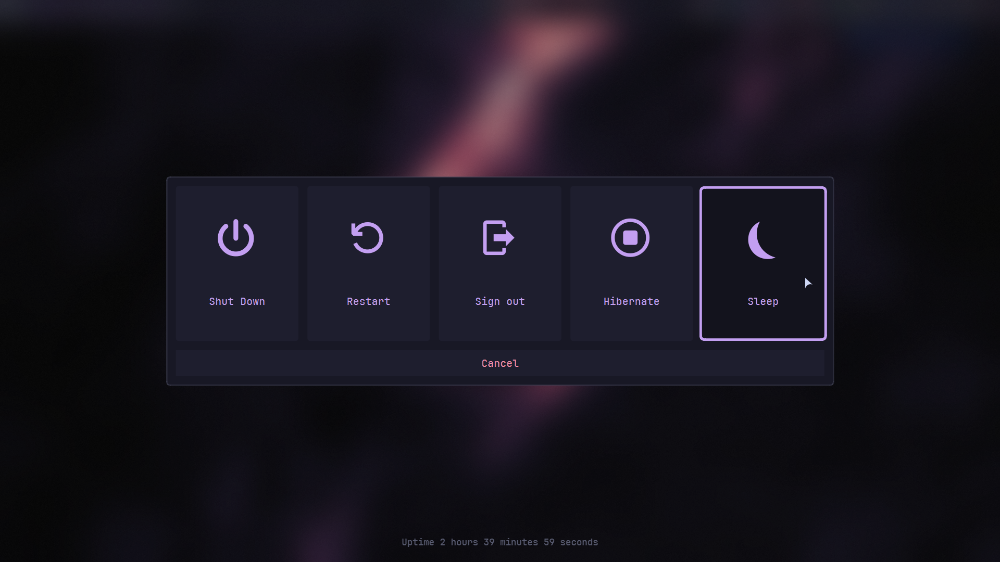<br>

<hr>

## 💕 About

> _A Catppuccin Mocha themed Windows dotfiles setup for those who love a beautiful, unified, and productive desktop._

If you love customizing every detail or just want a gorgeous, cohesive look with minimal hassle, **Windots** is for you. Whether you're a power user or just want things to look and work great out of the box, you'll find something here to make your Windows experience smoother and more enjoyable.

---

## 🌠 Features

<div align="center">

| | |
|---|---|
| 🪟 **GlazeWM** tiling window manager | 🍫 **YASB** status bar |
| 🧑‍💻 **VSCode** clean setup | >_ **Windows Terminal** modern look |
| 🐚 **PowerShell** enhancements | 🎨 **Oh My Posh** prompt |
| ⚙️ **fastfetch** system info | 🚀 **Flow Launcher** workflow |
| 🦅 Themed Start menu, Taskbar, Notification Center | 🧱 [Wallpapers](https://github.com/swopnil7/windots/tree/main/wallies#readme) |
| 🐈‍⬛ [Catppuccin Mocha](https://github.com/catppuccin) color scheme everywhere | 🌺 Theme for Almost Everything |

</div>

---

## 🌺 Core System Overview

| Component | Tool |
|---|---|
| **OS** | [Windows 11](https://www.microsoft.com/en-in/windows/windows-11) 🖥️ |
| **Window Manager** | [GlazeWM](https://github.com/glzr-io/glazewm) 🪟 |
| **Shells** | [PowerShell](https://learn.microsoft.com/en-us/powershell/) 💻 |
| **Terminal** | [Windows Terminal](https://github.com/microsoft/terminal) 🖲️ |
| **Status Bar** | [YASB](https://github.com/amnweb/yasb) 📊 |
| **Editors** | [VSCode](https://code.visualstudio.com/) 📝 |
| **Launcher** | [Flow Launcher](https://www.flowlauncher.com/) 🔍 |
| **File Managers** | [File Explorer](https://www.microsoft.com/en-us/windows/tips/file-explorer) 🗂️ |
| **Web Browser** | [Zen-Browser](https://zen-browser.app) 🌎 |
| **Theme** | [Catppuccin Mocha](https://catppuccin.com/) 🧁 |

---

<details>
<summary><strong>ℹ️ Complete System Overview</strong></summary>

#### 🪟 System

| 📚 Entry | ✨ App |
|---|---|
| **OS** | [Windows 11](https://www.microsoft.com/en-in/windows/windows-11) |
| **Window Manager** | 🤍 [GlazeWM](https://github.com/glzr-io/glazewm) [⚙️](https://github.com/swopnil7/windots/blob/master/.dotfiles/glazewm/config.yaml) |
| **Bar** | 🤍 [YASB](https://github.com/amnweb/yasb) [⚙️](https://github.com/swopnil7/windots/blob/master/.dotfiles/yasb/) |
| **Application Launcher** | 🤍 [Flow Launcher](https://www.flowlauncher.com/) [⚙️](https://github.com/swopnil7/windots/blob/main/.dotfiles/FlowLauncher/Settings.json) |
| **Mods** | 🤍 [Windhawk](https://windhawk.net/) [⚙️](https://github.com/swopnil7/windots/blob/main/.dotfiles/windhawk/) |
| **Context Menu** | [Nilesoft Shell](https://nilesoft.org/) [⚙️](https://github.com/swopnil7/windots/blob/main/.dotfiles/nilesoftshell/) |
| **Theme** | 🤍 [SecureUxTheme](https://github.com/namazso/SecureUxTheme) with [Nivuu's Catppuccin Mocha theme](https://www.deviantart.com/niivu/art/Catppuccin-for-Windows-11-1076249390) |

#### 🖥️ CLI/TUI Apps

| 📚 Entry | ✨ App |
|---|---|
| **Shell** | [pwsh](https://learn.microsoft.com/en-us/powershell/module/microsoft.powershell.core/about/about_pwsh?view=powershell-7.4) [⚙️](https://github.com/swopnil7/windots/blob/main/.dotfiles/Powershell/Microsoft.PowerShell_profile.ps1) |
| **Terminal Emulator** | [windows terminal](https://github.com/microsoft/terminal) [⚙️](https://github.com/swopnil7/windots/blob/main/.dotfiles/terminal/settings.json) |
| **Shell Prompt** | [ohmyposh](https://ohmyposh.dev/) [⚙️](https://github.com/swopnil7/windots/blob/main/.dotfiles/ohmyposh/zen.toml) |
| **System Fetch** | 🤍 [fastfetch](https://github.com/fastfetch-cli/fastfetch) [⚙️](https://github.com/swopnil7/dotfiles/blob/master/.dotfiles/fastfetch/config.jsonc) |
| **Terminal File Manager** | [superfile](https://github.com/yorukot/superfile) |

#### 🖱️ GUI Apps

| 📚 Entry | ✨ App |
|---|---|
| **Fallback Text Editor** | [VSCode](https://code.visualstudio.com/) [⚙️](https://github.com/swopnil7/windots/blob/main/.dotfiles/vscode/settings.json) |
| **Music Player** | 🤍 [Spotify](https://open.spotify.com/) (patched with [Spicetify](https://spicetify.app/)) |
| **Web Browser** | 🤍 [Zen-Browser](https://zen-browser.app) [⚙️](https://github.com/swopnil7/windots/blob/main/.dotfiles/zen/) |
| **Note Taking App** | 🤍 [Obsidian](https://obsidian.md/) |
| **File Manager** | [File Explorer](https://www.microsoft.com/en-us/windows/tips/file-explorer) | [⚙️](https://github.com/swopnil7/windots/blob/main/.dotfiles/explorer/) |
| **Game Launcher** | [Hydra Launcher](https://hydralauncher.gg/) [⚙️](https://github.com/swopnil7/windots/blob/main/.dotfiles/HydraLauncher/styles.css) |
| **Clipboard Manager** | [CopyQ](https://github.com/hluk/CopyQ) [⚙️](https://github.com/swopnil7/windots/blob/main/.dotfiles/copyq/catppuccin-mocha.ini) |
| **Torrent Manager** | [qBittorrent](https://www.qbittorrent.org/) [⚙️](https://github.com/swopnil7/windots/blob/main/.dotfiles/qBittorrent/catppuccin-mocha.qbtheme) |
| **Discord Client** | 🤍 [Vencord](https://vencord.dev/) |
| **YouTube Music Client** | [Th-Ch YouTube Music](https://github.com/th-ch/youtube-music) [⚙️](https://github.com/swopnil7/windots/blob/main/.dotfiles/youtubemusic/) |
| **Web Themer** | 🤍 [Stylus](https://addons.mozilla.org/en-US/firefox/addon/stylus/) (for Firefox) with 🤍 [Catppuccin Mocha](https://github.com/catppuccin) [⚙️](https://github.com/catppuccin/userstyles/blob/main/docs/USAGE.md) |

#### 🔍 Other

| 📚 Entry | ✨ App |
|---|---|
| **Colorscheme** | 🤍 [Catppuccin Mocha](https://catppuccin.com) |
| **Font** | [JetBrainsMono Nerd Font](https://www.jetbrains.com/lp/mono/) |

</details>

---

## 🔧 Setup

> **⚠️ Backup your current configuration files before continuing.**  
> Applying these settings may overwrite existing configs, so be sure to manually merge or restore as needed.

<details>
<summary><strong>🪟 GlazeWM</strong></summary>

- **Install** [**GlazeWM**](https://github.com/glzr-io/glazewm/releases/).
- [`windots/.dotfiles/glazewm/config.yaml`](.dotfiles/glazewm/config.yaml) → `%USERPROFILE%\.glzr\glazewm\`
- **Restart GlazeWM** for the changes to take effect.

</details>

<details>
<summary><strong>📊 YASB (Yet Another Status Bar)</strong></summary>

> [!NOTE]
> Ensure you have a Nerd Font installed for correct icon display. I use [**JetBrainsMono Nerd Font**](https://github.com/ryanoasis/nerd-fonts/releases/latest/download/JetBrainsMono.zip); if you use another Nerd Font, adjust the font settings in the YASB `styles.css` as needed.

- **Install** [**YASB**](https://github.com/amnweb/yasb/releases/).
- [`windots/.dotfiles/yasb/`](.dotfiles/yasb/) → `%USERPROFILE%\.config\yasb\`
- **Restart YASB** for the changes to take effect.

</details>

<details>
<summary><strong>📝 VSCode</strong></summary>

- **Install** the [Alt Catppuccin Theme](https://marketplace.visualstudio.com/items?itemName=dooez.alt-catppuccin-vsc) extension.
- **Install** the [GlassIt-VSC](https://marketplace.visualstudio.com/items?itemName=s-nlf-fh.glassit) extension and set the transparency level between 240-250 in its settings. *(Optional)*
- [`windots/.dotfiles/vscode/settings.json`](.dotfiles/vscode/settings.json) → `%APPDATA%\Code\User\`
- **Restart VSCode** to load the updated settings.

</details>

<details>
<summary><strong>📂 Windows Explorer</strong></summary>

> [!WARNING]
> This process requires **administrator privileges** and system modifications.

#### Step 1: Install SecureUxTheme

SecureUxTheme allows custom themes to be applied on Windows 11.

- **Install** [**SecureUxTheme**](https://github.com/namazso/SecureUxTheme/releases/tag/v4.0.0) using winget:

  ```bash
  winget install namazso.SecureUXTheme
  ```

- **Run SecureUxTheme** as administrator
- **Check** the `Hook SystemSettings` and `Remove DefaultColors` checkbox.
- **DO NOT** check `Hook Explorer` (can cause instability)
- Click **Install**
- **Reboot** your PC

#### Step 2: Install the Catppuccin Theme

- **Copy** all files and folders from [`windots/.dotfiles/explorer/Theme/`](.dotfiles/explorer/Theme/) → `C:\Windows\Resources\Themes\`
- After reboot, **open SecureUxTheme** again as administrator
- **Select** `Catppuccin Mocha` theme from the list
- Click **Patch and Apply**
- The theme is now active! You can now change it anytime from **Settings** → **Personalization** → **Themes**

#### Step 3: Apply Custom Icons (Windhawk)

> [!NOTE]
> Ensure you have [**Windhawk**](https://windhawk.net/) installed first.

- Open **Windhawk** and install the [**Icon Resource Redirect**](https://windhawk.net/mods/icon-resource-redirect) mod
- Open the mod's **settings**
- Select **Linuxfx 11 AIO** from the available icon theme presets
- Click **Apply**

#### Step 4: Add Explorer Blur Effect

- **Create** a folder for custom scripts (e.g., `C:\scripts\`)
- **Copy** the [`Explorerblur`](.dotfiles/explorer/Explorerblur/) folder → `C:\scripts\`
- **Navigate** to `C:\scripts\Explorerblur\`
- **Right-click** `register.cmd` and select **Run as administrator**
- The blur effect is now active!

</details>

<details>
<summary><strong>🌐 Browser</strong></summary>

> [!NOTE]
> These configs are applicable **only for Firefox-based browsers**.

#### Enable userChrome.css and userContent.css

1. Open `about:config` in the address bar.
2. Search for `toolkit.legacyUserProfileCustomizations.stylesheets`.
3. Set it to `true`.

#### Locate your profile folder

1. Open `about:support` in the address bar.
2. Find "Profile Folder" and click "Open Folder."

#### Copy the browser styling configs

- [`windots/.dotfiles/zen/userChrome.css`](.dotfiles/zen/userChrome.css) → `<Your Profile Folder>/chrome/`
- [`windots/.dotfiles/zen/userContent.css`](.dotfiles/zen/userContent.css) → `<Your Profile Folder>/chrome/`
- **Restart your browser** for the changes to take effect.

#### Optional: Theme websites

- **Install** the [**Stylus**](https://addons.mozilla.org/en-GB/firefox/addon/styl-us/) extension.
- **Download the [**Userstyles**](https://github.com/catppuccin/userstyles/releases/download/all-userstyles-export/import.json) import file.
- Open the Stylus "manage" page.
- On the sidebar panel, click the Import button in the Backup section, and select the downloaded Userstyles file.


For websites without userstyles, you can use the [**Dark Reader**](https://addons.mozilla.org/en-US/firefox/addon/darkreader/) extension:

1. Open Dark Reader extension settings.
2. Click on Dev tools > Advance > Preview New Design and close the window.
3. Go to See all options > Colors > Color Schemes & choose Catppuccin from the list of presets.
4. Close the settings tab (no apply button).

#### Custom Start Page

- Get my [**Catppuccin Themed Start Page**](https://github.com/swopnil7/startpage) or fork it to create your own.
- **Host it** on Github Pages or Vercel. I suggest using [**Vercel**](https://vercel.com/) as it's faster and easier to set up.
- Set it as your default home page in browser settings.
- For Firefox, you can also set it as the new tab page using the [**New Tab Override**](https://addons.mozilla.org/en-US/firefox/addon/new-tab-override/) extension.

</details>

<details>
<summary><strong>🚀 Flow Launcher</strong></summary>

- **Install** [**Flow Launcher**](https://www.flowlauncher.com/)
- [`windots/.dotfiles/FlowLauncher/`](.dotfiles/FlowLauncher/) → `%APPDATA%\FlowLauncher\`
- **Restart Flow Launcher**

</details>

<details>
<summary><strong>🦅 Windhawk</strong></summary>

- **Install** [**Windhawk**](https://windhawk.net/).
- **Install Relevant Mods** from the [Windhawk Store](https://windhawk.net/explore):
  - Notification Center Styler
  - Start Menu Styler
  - Taskbar Styler
  - Windows 11 File Explorer Styler
  - Translucent Windows
  - Taskbar auto-hide when maximized
- **Copy** the Windhawk config files from [`windots/.dotfiles/windhawk/`](.dotfiles/windhawk/)
- Open the relevant mod’s **details page**, go to **Advanced > Mod Settings**, paste the config, and click **"Load"** to apply it.

</details>

<details>
<summary><strong>🐚 Nilesoft Shell</strong></summary>

- **Install** [**Nilesoft Shell**](https://nilesoft.org/).
- **Copy** the shell theme file from [`windots/.dotfiles/nilesoftshell/theme.nss`](.dotfiles/nilesoftshell/theme.nss) → `C:\Program Files\Nilesoft Shell\imports\`
- **Open** the app with admin permissions and click on **Register**.

</details>

<details>
<summary><strong>🚀 Hydra Launcher</strong></summary>

- **Copy the content inside [`windots/.dotfiles/HydraLauncher/styles.css`](.dotfiles/HydraLauncher/styles.css)
- **Open** Hydra Launcher and go to **Settings** > **Appearance** > **Create**, type any name and press enter, then paste the config and save the file to apply it.

</details>

<details>
<summary><strong>🌐 qBittorrent</strong></summary>

- **Download** the config from [`windots/.dotfiles/qBittorrent/mocha.qbtheme`](.dotfiles/qBittorrent/catppuccin-mocha.qbtheme) & place it anywhere safe into a folder of your choice. I suggest making a separate folder for themes inside the script folder I asked to create earlier like `C:\scripts\themes\`
- **Open** qBittorrent and on the top bar go to **Tools** > **Options**, check the Use custom UI Theme options & then browse and select the downloaded theme file.

</details>

<details>
<summary><strong>🎵 Spotify</strong></summary>

- **Install** [**Spotify**](https://www.spotify.com/download/windows/) if you haven't already.
- **Open** Powershell and run the following commands to install **Spicetify** and **Spicetify Marketplace**:
  - Spicetify:

    ```powershell
    iwr -useb https://raw.githubusercontent.com/spicetify/cli/main/install.ps1 | iex
    ```
  - Spicetify Marketplace:

    ```powershell
    iwr -useb https://raw.githubusercontent.com/spicetify/marketplace/main/resources/install.ps1 | iex
    ```

- Open **Spotify** and in the top bar, click on the **Marketplace** icon, then search for **Comfy** theme and install it. Then, select Catppuccin Mocha as the scheme.

</details>

<details>
<summary><strong>🐈‍⬛ Discord</strong></summary>

- **Install** [**Discord**](https://discord.com/download) if you haven't already.
- **Download** [**Vencord**](https://github.com/Vencord/Installer/releases/latest/download/VencordInstaller.exe) and **Install** it.
- Open Discord and the click on the **Settings** icon at the bottom beside your profile. Under the **Vencord** section, click on **Themes** and then click on **Edit QuickCSS**. Paste the text below into the editor:

  ```css
  @import url("https://catppuccin.github.io/discord/dist/catppuccin-mocha-pink.theme.css");
  ```
- **Save** the changes with Ctrl + S and quit the editor.

</details>

<details>
<summary><strong>🎥 YouTube Music</strong></summary>

- **Install** [**Th-Ch YouTube Music**](https://github.com/th-ch/youtube-music/releases).
- **Download** the config from [`windots/.dotfiles/youtubemusic/ytmusic.css`](.dotfiles/youtubemusic/ytmusic.css) & place it anywhere safe into a folder of your choice, probably the same folder you used for the qBittorrent theme.
- **Open** YouTube Music and on the top bar go to **Options** > **Visual Tweaks** > **Theme** and click on Import custom css file, then browse and select the downloaded theme file.

</details>

<details>
<summary><strong>©️ CopyQ</strong></summary>

- **Install** [**CopyQ**](https://github.com/hluk/CopyQ/releases).
- **Copy** the config files from [`windots/.dotfiles/copyq/catppuccin-mocha.ini`](.dotfiles/copyq/catppuccin-mocha.ini) → `%APPDATA%\CopyQ\themes\`
- **Open** CopyQ, on the top bar go to **File** > **Preferences** > **Appearance**, click on load theme, select the `catppuccin mocha.ini` file you copied earlier, and click on **Apply**.

</details>

<details>
<summary><strong>🔗 ShareX</strong></summary>

- **Install** [**ShareX**](https://getsharex.com/).
- **Copy** the content of [`windots/.dotfiles/sharex/sharex.json`](.dotfiles/sharex/sharex.json) to your clipboard.
- **Open** ShareX's **Application Settings** and click to **Theme** > **Import** > **From Clipboard**.

</details>

---

## \>_ Terminal & Shell Setup

<details>
<summary><strong>🖥️ Windows Terminal</strong></summary>

- **Install** [**Windows Terminal**](https://github.com/microsoft/terminal)
- [`windots/.dotfiles/terminal/settings.json`](.dotfiles/terminal/settings.json) → `%LOCALAPPDATA%\Packages\Microsoft.WindowsTerminal_8wekyb3d8bbwe\LocalState\`
- **Restart Windows Terminal** to see the updated config.

</details>

<details>
<summary><strong>🐚 PowerShell</strong></summary>

> [!TIP]
> For the best experience, install the latest version of PowerShell from the [official GitHub releases](https://github.com/PowerShell/PowerShell/releases) instead of using the default Windows PowerShell.

- [`windots/.dotfiles/Powershell/Microsoft.PowerShell_profile.ps1`](.dotfiles/Powershell/Microsoft.PowerShell_profile.ps1) → `%USERPROFILE%\Documents\PowerShell\`
- Restart PowerShell to apply the changes.

</details>

<details>
<summary><strong>🎨 Oh My Posh</strong></summary>

- **Install** [**Oh My Posh**](https://ohmyposh.dev/docs/installation/windows) using winget:

  ```bash
  winget install JanDeDobbeleer.OhMyPosh -s winget
  ```

- [`windots/.dotfiles/ohmyposh/zen.toml`](.dotfiles/ohmyposh/zen.toml) → `%USERPROFILE%\.config\ohmyposh\`

</details>

<details>
<summary><strong>⚙️ Fastfetch</strong></summary>

- **Install** [**fastfetch**](https://github.com/fastfetch-cli/fastfetch) using **winget**:

  ```bash
  winget install fastfetch
  ```

- [`windots/.dotfiles/fastfetch/config.jsonc`](.dotfiles/fastfetch/config.jsonc) → `%USERPROFILE%\.config\fastfetch\`
- [`windots/.dotfiles/fastfetch/windows.txt`](.dotfiles/fastfetch/windows.txt) → `%USERPROFILE%\.config\fastfetch\`
- **Run fastfetch**.

</details>

<details>
<summary><strong>📂 Superfile</strong></summary>

- **Run** this command in **powershell**:

  ```bash
  winget install --id yorukot.superfile
  ```

</details>

<details>
<summary><strong>⌨️ AutoHotKey</strong></summary>

- [`windots/.dotfiles/AutoHotKey/`](.dotfiles/AutoHotkey/) → `%USERPROFILE%\Documents\AutoHotKey`
- **Open** the AutoHotkey Folder and **Launch** the **WindowsUtilities.ahk** script.. You will see it appear in the tray menu.

> To configure the script to start with the system on boot:

- Create a shortcut of the **WindowsUtilities.ahk** filescript.
- Open **Run** (Win+R) and type shell:startup then hit Enter. Copy the created shortcut to the just launched directory.

</details>

---

## ⌨️ GlazeWM Keybindings

<details>
<summary>Show Keybindings</summary>

### Window Management

| Keys | Action |
|---|---|
| <kbd>alt</kbd> + <kbd>h</kbd> / <kbd>j</kbd> / <kbd>k</kbd> / <kbd>l</kbd> | Focus window left / down / up / right |
| <kbd>alt</kbd> + <kbd>shift</kbd> + <kbd>h</kbd> / <kbd>j</kbd> / <kbd>k</kbd> / <kbd>l</kbd> | Move focusing window left / down / up / right |
| <kbd>alt</kbd> + <kbd>q</kbd> | Close focusing window |
| <kbd>alt</kbd> + <kbd>m</kbd> | Toggle window minimization |
| <kbd>alt</kbd> + <kbd>f</kbd> | Toggle fullscreen |
| <kbd>alt</kbd> + <kbd>t</kbd> | Toggle tiling mode |
| <kbd>alt</kbd> + <kbd>space</kbd> | Toggle floating (centered) |
| <kbd>alt</kbd> + <kbd>shift</kbd> + <kbd>v</kbd> | Toggle tiling direction |
| <kbd>alt</kbd> + <kbd>1-9</kbd> | Focus workspace {n} |
| <kbd>alt</kbd> + <kbd>shift</kbd> + <kbd>1-9</kbd> | Move focusing window to workspace {n} |
| <kbd>alt</kbd> + <kbd>,</kbd> / <kbd>.</kbd> | Resize active window's width -/+ 2% |
| <kbd>alt</kbd> + <kbd>⬆️</kbd> / <kbd>⬇️</kbd> | Resize acive window's height +/- 2% |
| <kbd>alt</kbd> + <kbd>shift</kbd> + <kbd>e</kbd> | Exit GlazeWM |
| <kbd>alt</kbd> + <kbd>shift</kbd> + <kbd>r</kbd> | Reload GlazeWM config |
| <kbd>alt</kbd> + <kbd>shift</kbd> + <kbd>p</kbd> | Pause/Resume all GlazeWM keybindings |
| <kbd>alt</kbd> + <kbd>shift</kbd> + <kbd>l</kbd> | Toggle YASB launchpad widget |
| <kbd>alt</kbd> + <kbd>shift</kbd> + <kbd>w</kbd> | Toggle YASB wallpapers widget |

### Application Shortcuts

| Keys | Action |
|---|---|
| <kbd>alt</kbd> + <kbd>enter</kbd> | Open terminal |
| <kbd>alt</kbd> + <kbd>e</kbd> | Open File Explorer |
| <kbd>alt</kbd> + <kbd>v</kbd> | Open VSCode |
| <kbd>alt</kbd> + <kbd>n</kbd> | Open Notepad |
| <kbd>alt</kbd> + <kbd>b</kbd> | Open Zen Browser |
| <kbd>alt</kbd> + <kbd>s</kbd> | Open Spotify |
| <kbd>alt</kbd> + <kbd>y</kbd> | Open Youtube Music |

</details>

---

## 🖼️ Gallery

> You can check out the **wallpapers** [**here**](https://github.com/swopnil7/windots/tree/main/wallies#readme) if you're interested!

<div align="center">

| **GUI Text Editor** | **Start Menu, Taskbar and Notification Center** |
|:--:|:--:|
|  |  |

| **Spotify with Spicetify** | **Power Menu** |
|:--:|:--:|
| 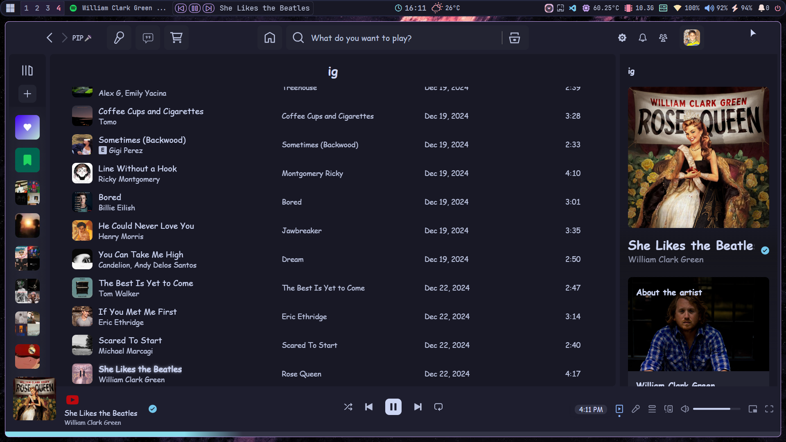 |  |

| **GlazeWM Window Manager** | **Flow Launcher** |
|:--:|:--:|
| 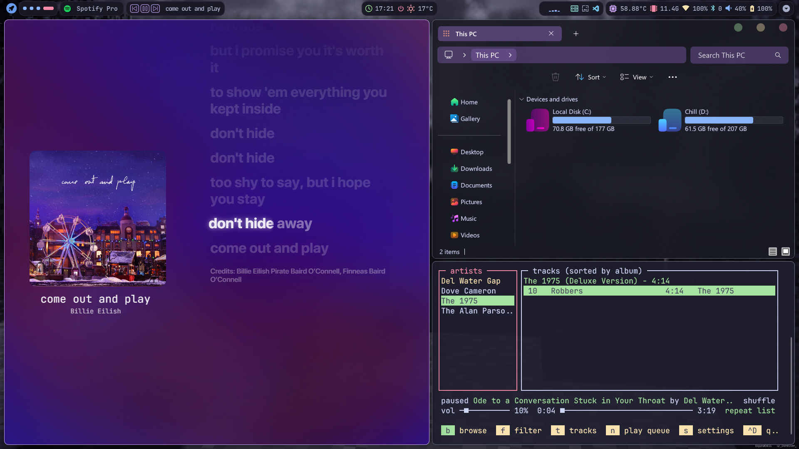 | 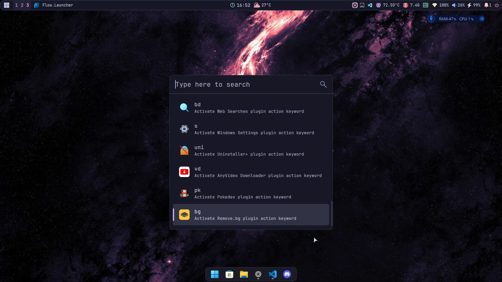 |

| **Discord Client** | **Web Browser** |
|:--:|:--:|
| 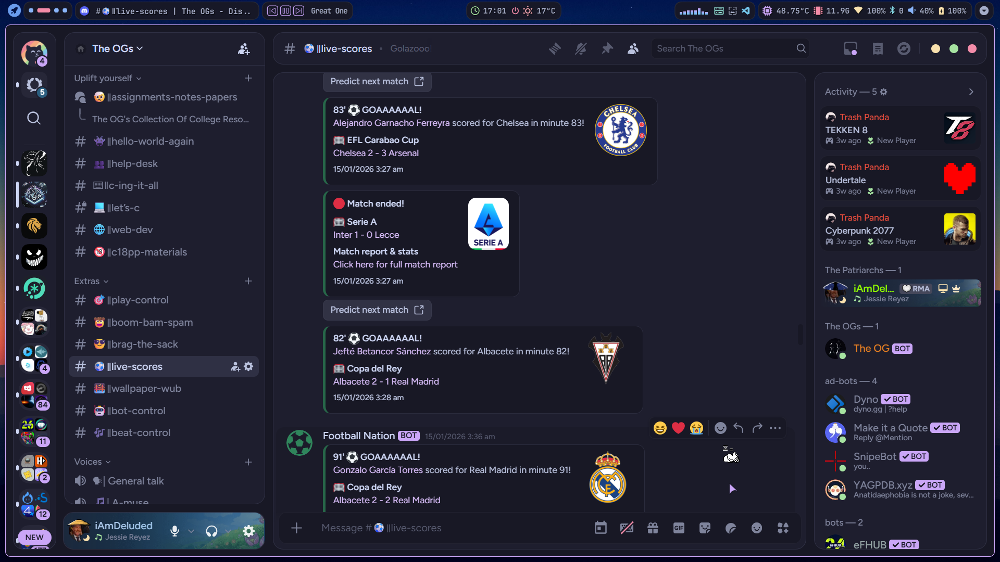 | 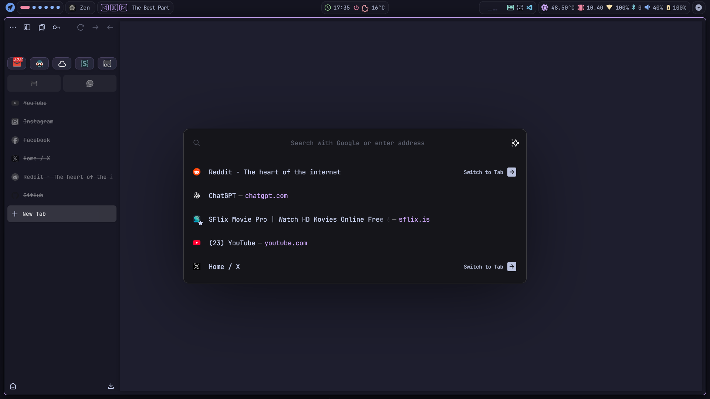 |

</div>

---

## 📢 Discussions

Have questions, suggestions, or want to showcase your setup? Or maybe you need some help?  
Visit the [Discussions](https://github.com/swopnil7/windots/discussions) section.

> **⚠️ Please open an [issue](https://github.com/swopnil7/windots/issues) _only_ for reproducible bugs or critical problems.**  
> For all other questions, feedback, or general help, [Discussions](https://github.com/swopnil7/windots/discussions) is **preferred**.

---

## 🎉 Credits

Special mention to the following resources and projects that were especially helpful during setup:

- [**pivoshenko**](https://github.com/pivoshenko/catppuccin-startpage) for the clean and aesthetic **browser startpage** 🌐
- [**GlazeWM**](https://github.com/glzr-io/glazewm) for delivering an outstanding **tiling window manager** that boosts productivity ✨
- [**YASB**](https://github.com/amnweb/yasb) for a **customizable and feature-rich status bar** that fits seamlessly into the setup 🚀
- [**Catppuccin**](https://catppuccin.com) for creating the **best color scheme** ever 🖌️
- [**Ashish**](https://github.com/ashish0kumar) for some of the **file configs** & **readme design** 🤍